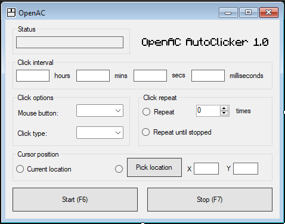

## OpenAC AutoClicker v1.0

OpenAC is an open source auto clicker software. It started as a recoding exercise of OP Auto Clicker-- I wanted to test
and see if I could remake a C# forms app from only viewing it's UI (no code) in a day or two. After finishing, I 
identified some changes/features I wanted to implement to improve the usability of the application. These features are 
what make OpenAC unique today. This is not a groundbreaking C# form, but I hope it is useful to some of you. 

## About/Features
The software is completely written in C#, using user32.dll calls to simulate mouse clicks. It offers the following
features:
- Adjustable click speed
- Adjustable click location
- Adjustable click type (left, right, middle)
- Adjustable click count (single or double)
- Adjustable hotkey to start and stop clicking
- Status indicator in the system tray

## Binaries
The entire purpose of this project is to allow you to audit, edit, and build the project yourself. No binaries will be
provided in the releases section. If you would like to use the software, you will need to build it yourself.


## Building from Source

1. Clone the repository
    ```Git Bash
    
    git clone https://github.com/BlinkDynamo/OpenAC.git
    
    ```

2. Open the project in Visual Studio and build it with the following steps:
    - Open Visual Studio
    - Click on "Open a project or solution"
    - Navigate to the cloned repository and open the .sln file
    - Click on "Build" in the top menu
    - Click on "Build Solution"
    - Navigate to the "OpenAC/build/" folder and run the executable

## Contributing
Contributions are always welcome, however, since the project is both minimal in scope and a personal project, I may not
accept most pull requests unless they are bug fixes/oversights.


## License

[MIT](https://choosealicense.com/licenses/mit/)