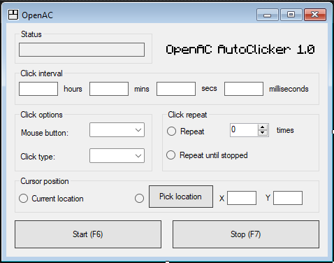

## OpenAC AutoClicker v1.0

OpenAC is an open source improvement of the [OP Auto Clicker](https://www.opautoclicker.com/index.html). Under the 
"Features" section they claim that their software is "Virus Free". This is a bit of a funny claim for a project that is 
in an open source section of SourceForge, yet only provides executables in their repo. I am in no way casting malicious 
intent on the developers-- it's just a silly thing to say as a developer is all.

## About/Features
As this is a recoding of the original project, much of the features are the same. I am aiming for this project's 
end result to be 90% similar to OP Auto Clicker, minus a few features I found redundant. The software is completely 
written in C#, using the SendKeys class for the mouse input.

## Build and Install
I was torn if I should also include an executable option for this project, but I decided it couldn't hurt. The 
purpose of this project in the first place was to provide an open source version of the original and allow you
to build an executable yourself, however, more options almost always outweighs less. Because of this, a premade
executable is available in the releases page.


### Building from Source

1. Clone the repository
    ```Git Bash
    
    git clone https://github.com/BlinkDynamo/OpenAC.git
    
    ```

2. Open the project in Visual Studio and build it with the following steps:
    - Open Visual Studio
    - Click on "Open a project or solution"
    - Navigate to the cloned repository and open the .sln file
    - Select "Release" from the Solution Configurations dropdown
    - Click on "Build" in the top menu
    - Click on "Build Solution"
    - Navigate to the "OpenAC\OpenAC\bin\Release" folder and run the executable

### Installing from Release

1. Download the installer from the releases page
2. Run the installer and follow the instructions

## Contributing

The purpose of this project is simply to be an open source second option of the original project. As such,
I am not looking to add any features or make any changes more than I've already made. If you have structural
changes or bug fixes however (or find some redundancies you would like to remove), feel free to make a pull request.


## License

[MIT](https://choosealicense.com/licenses/mit/)